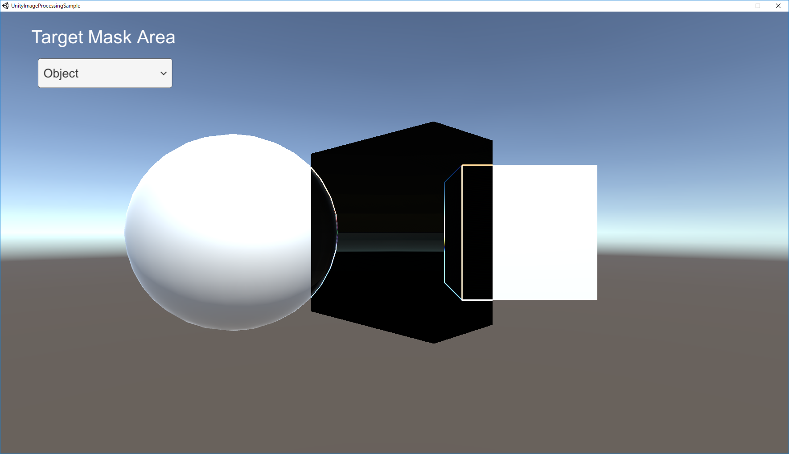
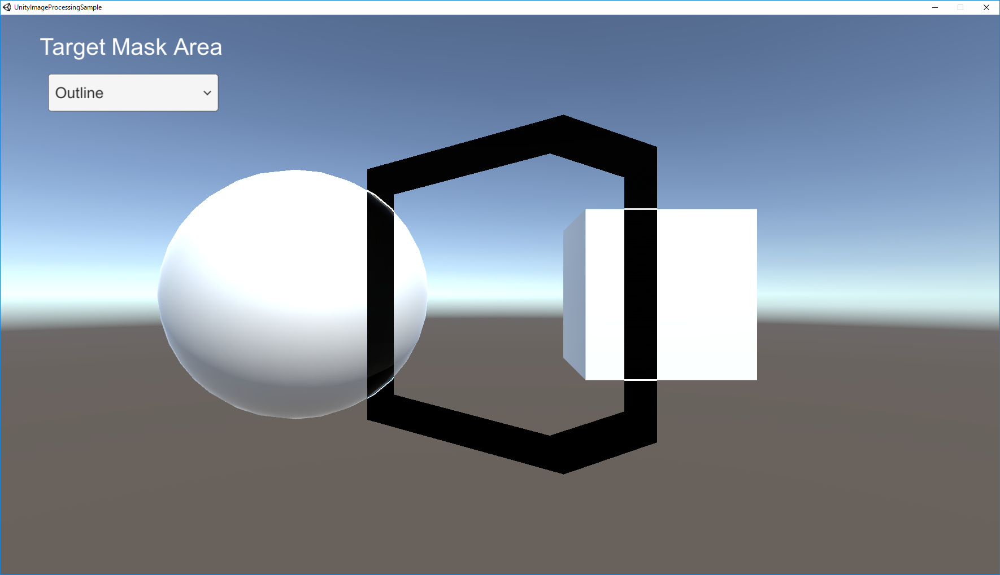
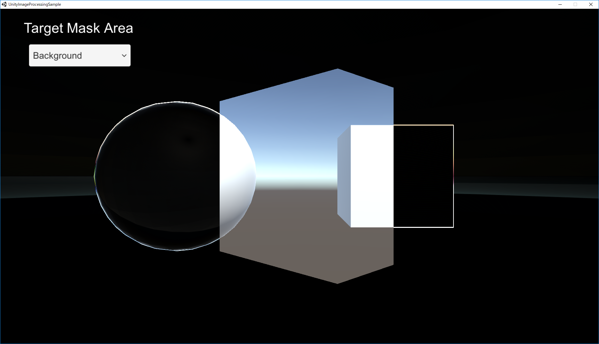
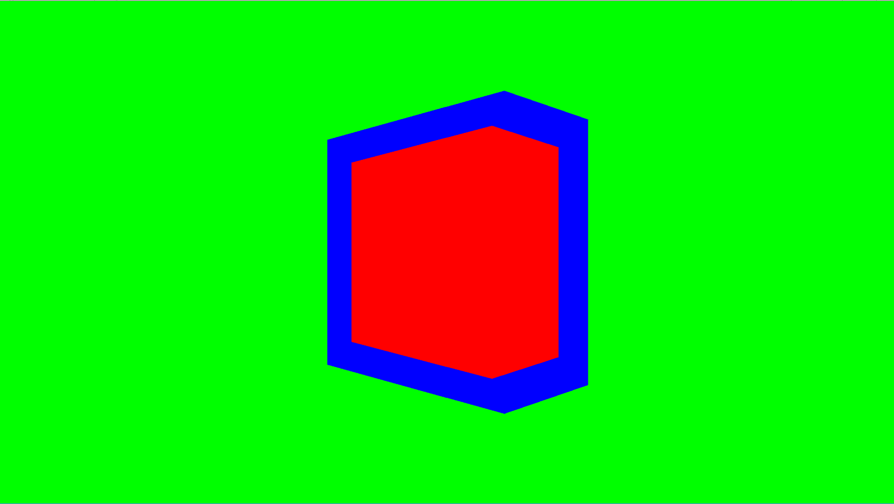

# Sobel filtering using area mask

## About
- ステンシルバッファを使わずに特定の領域にソーベルフィルタを適用する  
- マテリアルのTarget Mask Colorで指定した色のマスク領域にフィルタを適用する
- マスク画像生成用の色はBackgroud Mask Color, Outline Mask Color, Object Mask Colorで設定する
- カメラのMSAA・HDRが有効な状態であっても意図した通りに動作している

## Tips
- ジオメトリシェーダーを使うことでスクリーンと同じ大きさのQuadを生成している
- マスク画像はFrame Debuggerで確認可能

## Images

Results

Mask

